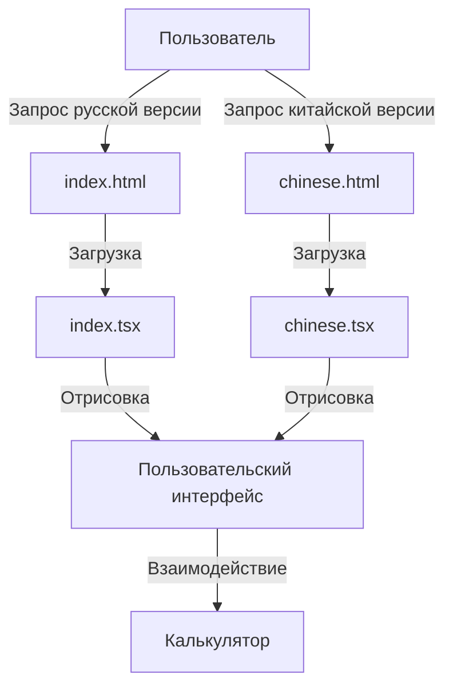

# Системная архитектура и паттерны

## Общая архитектура приложения

Приложение представляет собой статический одностраничный веб-сайт (SPA) с дополнительной страницей для китайской версии. Вся бизнес-логика выполняется на стороне клиента.



## Структура данных

Основной структурой данных является многоуровневый JSON-объект, получаемый в результате парсинга текстовых данных прайс-листа. Ключевые сущности:

1. **PriceItem** - отдельная строка в таблице тарифов
   ```typescript
   interface PriceItem {
     id: string;
     density: string;
     priceMoscow1: string;
     priceMoscow2: string;
     deliveryMoscow: string;
     priceAlmaty1: string;
     priceAlmaty2: string;
     deliveryAlmaty: string;
     priceMoscowLessThan100_Type1: string;
     priceAlmatyLessThan100_Type1: string;
     priceMoscowLessThan100_Type2: string;
     priceAlmatyLessThan100_Type2: string;
   }
   ```

2. **PriceCategory** - категория товаров с набором тарифов
   ```typescript
   interface PriceCategory {
     name: string;
     items: PriceItem[];
   }
   ```

3. **ParsedData** - полная структура распарсенных данных
   ```typescript
   interface ParsedData {
     mainTitle: string;
     priceNote: string;
     effectiveDateTitle: string;
     categories: PriceCategory[];
     conditionsTitle: string;
     conditions: string[];
   }
   ```

## Ключевые компоненты

### 1. Парсер данных прайс-листа
Функция `parsePriceData` преобразует текстовый прайс-лист в структурированный объект для дальнейшего использования компонентами. Этот компонент отвечает за извлечение всех необходимых данных из текстового представления.

### 2. Компонент калькулятора
Компонент `Calculator` принимает категории тарифов и позволяет пользователю рассчитать стоимость доставки на основе введенных данных. Используется сложная логика для определения применимого тарифа в зависимости от плотности груза.

### 3. Система локализации
Для поддержки многоязычности используется простой механизм переводов с функцией `t(text)`, которая возвращает перевод текста на текущий язык. Для китайской версии используются предопределенные переводы в объекте `chineseTranslations`.

## Паттерны проектирования

### 1. Компонентный подход
Приложение структурировано с использованием компонентного подхода React, где каждый компонент отвечает за определенную функциональность.

### 2. Разделение состояния и представления
Используется React Hooks (useState, useEffect, useCallback) для управления состоянием компонентов и отделения его от логики отображения.

### 3. Функциональный подход к обработке данных
Применяется функциональный подход с использованием методов массивов (map, filter, find) для обработки данных прайс-листа.

### 4. Паттерн "Стратегия" для расчета цен
В зависимости от плотности груза применяются различные стратегии расчета:
- Для грузов с плотностью < 100 кг/м³ используется расчет на основе объема
- Для грузов с плотностью ≥ 100 кг/м³ используется расчет на основе веса

## Техническая реализация

### Сборка и развертывание
Используется Vite для сборки проекта и Netlify для развертывания. Конфигурация Netlify включает правила перенаправления для поддержки многостраничного SPA.

```
[build]
  command = "npm run build"
  publish = "dist"

[[redirects]]
  from = "/chinese.html"
  to = "/index.html"
  status = 200
  force = true

[[redirects]]
  from = "/*"
  to = "/index.html"
  status = 200
```

### Особенности реализации

1. **Обработка различных единиц измерения**: Система корректно обрабатывает тарифы, указанные как в долларах за килограмм, так и в долларах за кубический метр.

2. **Валидация ввода пользователя**: Реализована проверка корректности введенных данных с информативными сообщениями об ошибках.

3. **Динамический расчет плотности**: Плотность груза рассчитывается автоматически на основе введенных веса и объема.

4. **Адаптивный интерфейс**: Интерфейс приложения адаптирован для различных устройств, от мобильных до десктопных. 